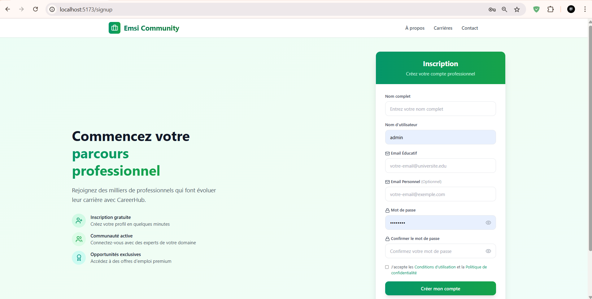
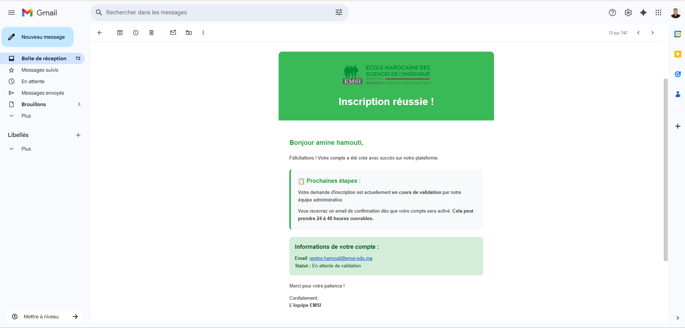
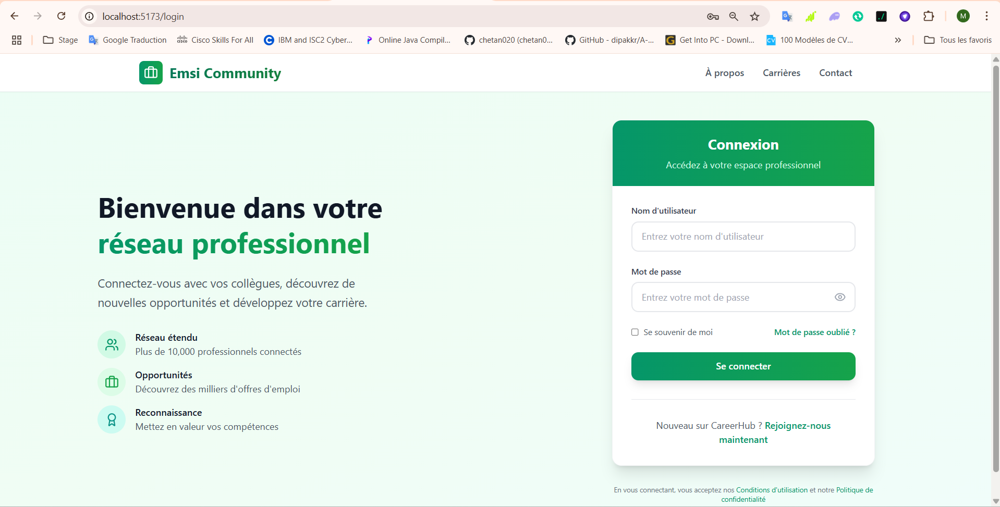
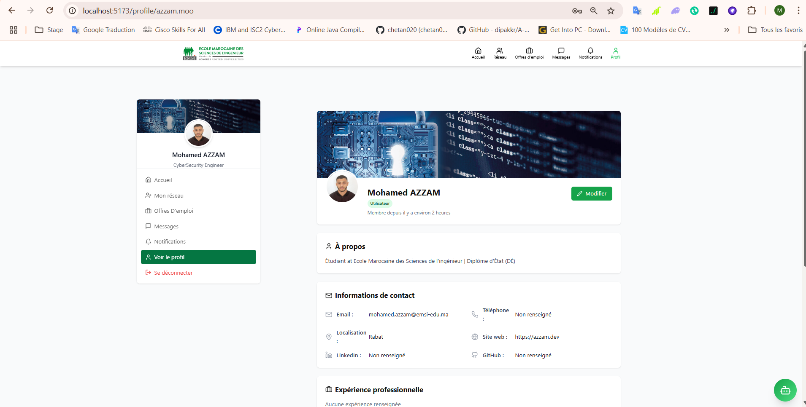
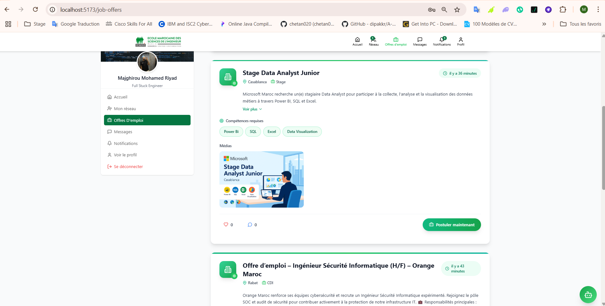
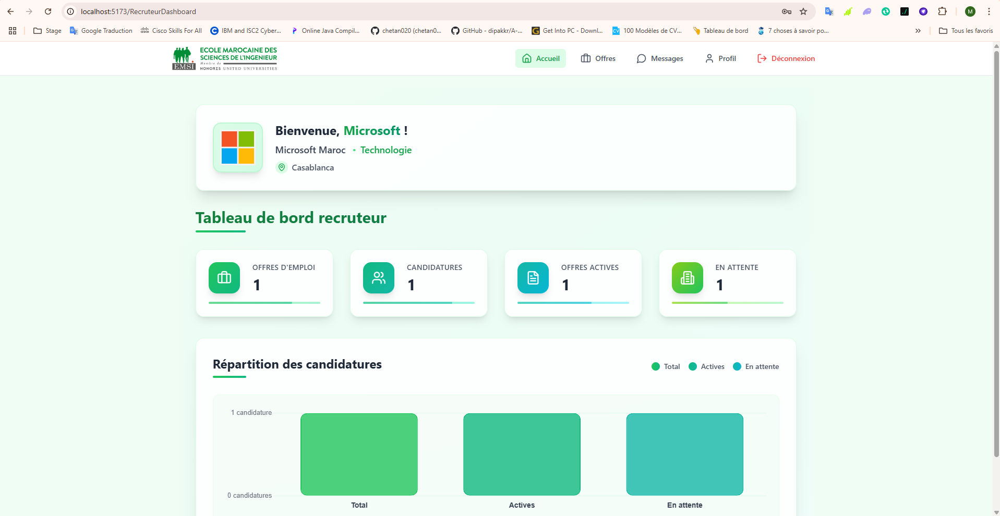
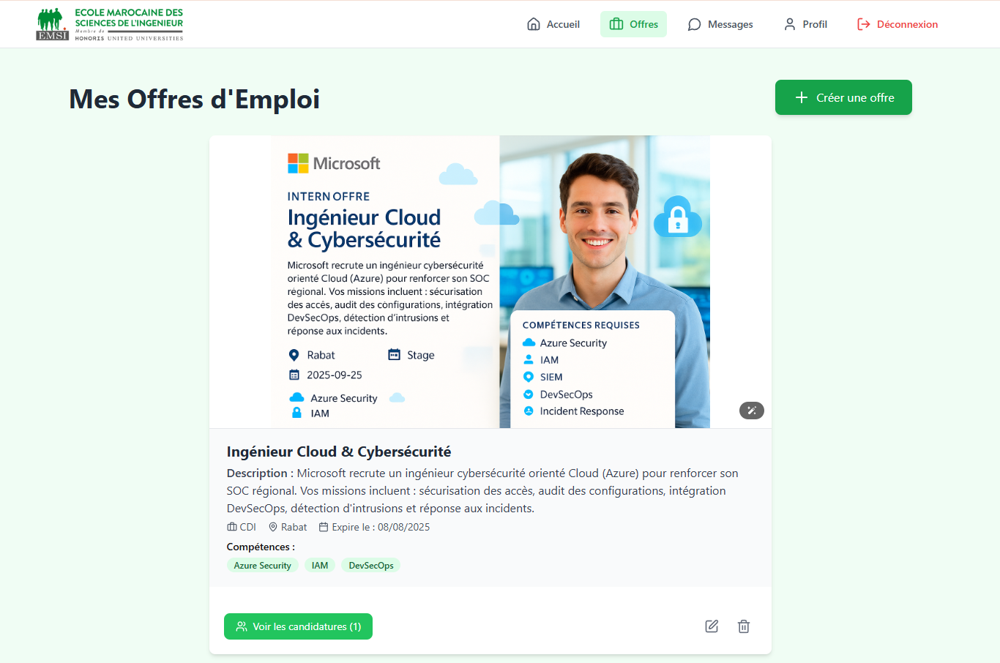
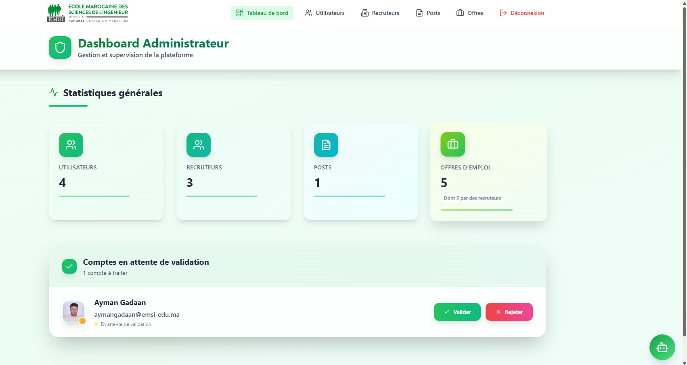
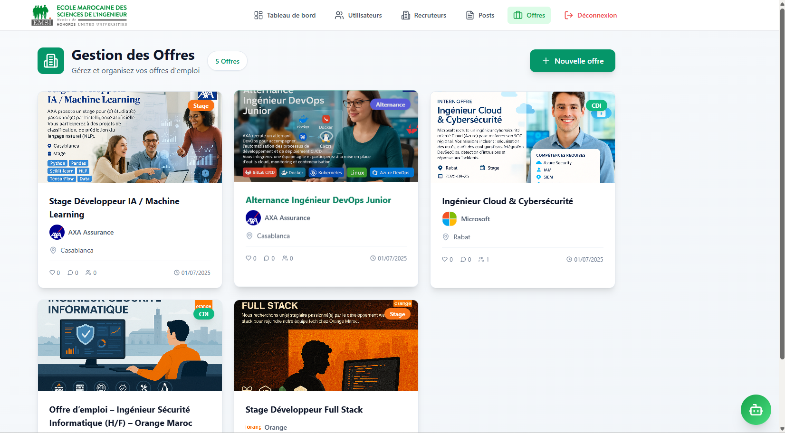

# EMSI Career Connect

**EMSI Career Connect** est une plateforme web de **recrutement** et de **réseautage professionnel** dédiée aux lauréats de l’EMSI. Ce portail vise à faciliter l’insertion des jeunes diplômés sur le marché de l’emploi, tout en offrant aux recruteurs un espace pour publier, gérer et suivre leurs offres.

---

## ⚙️ Installation locale

### 🔽 Prérequis

- Node.js (v18+ recommandé)
- MongoDB Atlas ou local
- Compte Azure (pour déploiement et stockage optionnel)
- Git

### 🧩 Étapes

```bash
# 1. Cloner le projet
git clone https://github.com/Azzammoo10/Emsi-Career-connect.git
cd Emsi-Career-connect
code .

# 2. Installer les dépendances backend
cd backend
npm install

# 3. Créer un fichier .env
cp .env.example .env
# puis configure les variables comme MONGO_URI, JWT_SECRET, etc.

# 4. Lancer le serveur backend
npm run dev

# 5. Installer les dépendances frontend
cd ../frontend
npm install

# 6. Lancer le serveur frontend
npm run dev
```

---

## 🚀 Fonctionnalités principales

### 👩‍🎓 Côté Lauréat
- Création de profil (éducation, expérience, CV, compétences)
- Recherche et candidature aux offres d’emploi
- Messagerie privée et réseau social
- Notifications en temps réel (offres, candidatures, messages...)

### 🏢 Côté Recruteur
- Création et gestion des offres d’emploi
- Suivi des candidatures
- Présentation de l’entreprise avec logo
- Tableau de bord analytique

### 🛡️ Côté Administrateur
- Gestion des utilisateurs et comptes
- Validation d’inscription et modération
- Gestion des offres et contenus

---

## 🛠️ Stack technique

| Côté        | Technologies principales                        |
|-------------|-------------------------------------------------|
| **Frontend** | React.js, Tailwind CSS, React Query            |
| **Backend**  | Node.js, Express.js, Socket.io, JWT, bcrypt    |
| **Base de données** | MongoDB (NoSQL) via Mongoose          |
| **Stockage & Déploiement** | Azure Blob Storage, Azure App Service |
| **CI/CD** | GitHub Actions                                     |

---

## 📦 Architecture du projet

```bash
emsi-career-connect/
├── frontend/       # Interface utilisateur React
├── backend/        # API REST Express.js + WebSockets
├── .env            # Variables d’environnement
├── mail.html       # Template d’e-mail personnalisé
└── README.md
```

---
## 📸 Aperçu visuel de la plateforme

### 📝 Page d’inscription
> Interface claire pour créer un compte lauréat, recruteur ou administrateur.


---


---

### 📧 Email de confirmation
> Email automatique envoyé après inscription avec message de validation.


---
### 🔐 Page de connexion
> Interface sécurisée pour se connecter avec vérification des rôles et gestion des erreurs.

---
### 👤 Profil lauréat validé
> Exemple de profil complet avec informations, expériences et réseaux.


---

### 💼 Offres d’emploi – Côté Lauréat
> Liste des offres disponibles avec compétences requises et option de postulation directe.


---
### 📊 Tableau de bord Recruteur
> Statistiques et répartition des candidatures reçues.


---

### 🧩 Gestion des offres – Côté Recruteur
> Interface intuitive pour ajouter, modifier et gérer ses offres d’emploi.



---

### 🛡️ Dashboard Administrateur
> Vue centralisée de supervision : utilisateurs, recruteurs, offres et validation des comptes.


---

### 🗃️ Gestion des Offres – Côté Administrateur
> Liste complète des offres créées par les recruteurs avec filtres et actions.



---

## 🔐 Authentification & Sécurité

- Authentification par JWT (avec cookie sécurisé)
- Middleware de protection des routes et rôles (`laureat`, `recruteur`, `admin`)
- Vérification email et activation de compte
- Stockage sécurisé des fichiers sur Azure

---

## 🌐 Déploiement

- **Frontend** : Azure Static Web Apps
- **Backend** : Azure App Service
- **Fichiers** : Azure Blob Storage
- **CI/CD** : GitHub Actions

---

## 👥 Contributeurs

- **Mohamed Azzam**  
  Développeur Backend – Intégration de la base de données, sécurisation des routes API, déploiement sur Azure et gestion du stockage cloud.  
  GitHub : [@azzammoo10](https://github.com/azzammoo10)

- **Majhirou Mohamed Riyad**  
  Développeur Frontend – Conception de l’interface utilisateur avec React & Tailwind, expérience utilisateur (UI/UX) et intégration des pages dynamiques.  
  GitHub : [@riyad4589](https://github.com/riyad4589)


---

## 📄 Licence

Ce projet est réalisé dans le cadre du **Projet de Fin d’Année (PFA)** à l’**EMSI**. Utilisation réservée à des fins pédagogiques.

---

> 📚 Pour plus d’infos techniques, consultez la [Documentation technique](./TECH_DOC.md)  
  
> 📬 En attendant, vous pouvez me contacter à : [azzam.moo@gmail.com](mailto:azzam.moo@gmail.com)

